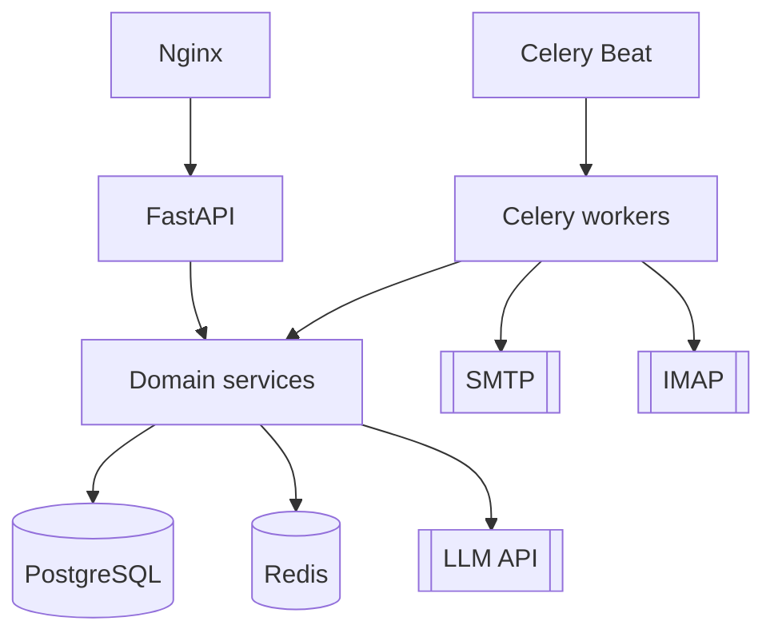
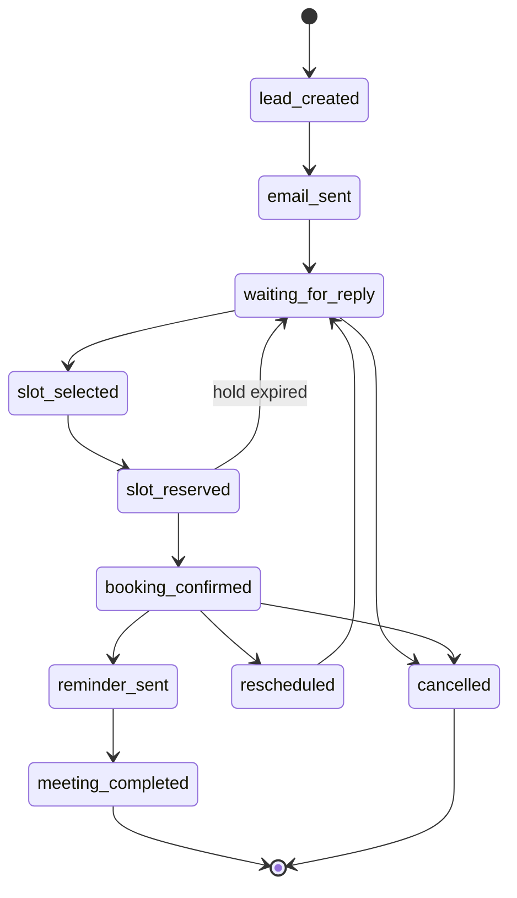

# Architecture

## 1. The BookMyShow analogy

| Movie booking        | This system                                  |
|----------------------|----------------------------------------------|
| Seats                | Meeting time slots                           |
| Screens              | Organizer calendars                          |
| Seat inventory       | Generated availability windows               |
| "Hold seat 10 min"   | Redis lock + `reservations` row (TTL 10 min) |
| Booking UI           | The email thread                             |
| Ticket confirmation  | Confirmation email                           |

The core insight is **reservation-first**: when a lead confirms a slot we do not
immediately write a booking and hope no one else picked it. We *hold* it (fast,
expiring lock), then confirm. Holds outlive the lock and are swept if they
expire.

## 2. Components



(See `architecture.mermaid` for the full diagram.)

- **FastAPI** — thin HTTP layer: auth, lead intake, admin, inbound webhook,
  health, metrics. No business logic lives here; it delegates to services.
- **Domain services** — a pure-ish library reused by both the API and workers.
- **Celery workers + beat** — all email I/O and time-based work (sends, IMAP
  polling, reminder dispatch, expired-hold sweeping) so the API stays fast and
  every side-effect is retryable.
- **PostgreSQL** — source of truth and the *final* arbiter against double
  booking (partial-unique index).
- **Redis** — distributed locks, the fast "is this slot held?" marker, rate
  limiting, caching, and the Celery broker/result backend.

## 3. Concurrency & double-booking prevention (the crux)

Three layers, defense-in-depth:

1. **Redis lock, fail-fast.** On confirm we `SET lock:{org}:{slot} NX PX 5s`.
   The first concurrent confirmer wins; others get `SlotUnavailable` instantly
   and are offered alternatives. Release is a Lua compare-and-delete so we never
   delete a lock we no longer own.
2. **In-lock DB re-check.** Inside the lock we re-query for a live `HELD`
   reservation on that slot, covering the (rare) case where a lock expired
   mid-flight.
3. **Database partial-unique index** on `bookings(organizer_id, slot_start)`
   filtered to active states. Even if both layers above were bypassed, the
   second `INSERT/UPDATE` raises `IntegrityError` and we convert it to
   `SlotUnavailable`. The DB has the last word.

```mermaid
sequenceDiagram
    participant L as Lead reply "YES 2"
    participant P as Email processor
    participant R as Redis
    participant D as Postgres
    L->>P: intent=confirm_slot, idx=2
    P->>R: SET lock NX PX 5s
    alt lock acquired
        P->>D: re-check + INSERT reservation (HELD, +10min)
        D-->>P: ok (or IntegrityError -> SlotUnavailable)
        P->>R: SET hold marker EX 600
        P->>D: status=CONFIRMED, state=BOOKING_CONFIRMED
        P-->>L: confirmation email
    else lock lost / race
        P->>D: find nearest open slots
        P-->>L: "that time went — here are 3 others"
    end
    Note over R: lock auto-expires (5s); hold persists 10 min,<br/>swept by beat if unconfirmed
```

**Idempotency.** Email is at-least-once. IMAP dedupes on
`(thread_id, message_id)`; reservations carry an `idempotency_key` so a retried
"YES 2" returns the existing hold instead of creating a second one.

## 4. Email loop & anti-spoofing

- Every outbound message sets RFC 5322 `Message-ID` / `In-Reply-To` /
  `References` so replies thread correctly, and a `Reply-To` of
  `reply+<token>@inbound-domain`.
- `<token>` is an **HMAC** of the booking id (`app/core/security.py`). Inbound
  replies are bound to a thread by *verifying the token*, not by trusting the
  `From` header — so a spoofed sender can't drive someone else's booking.
- Two ingestion paths, interchangeable: the **IMAP poller** (Celery beat) or a
  provider **webhook** (`POST /webhooks/email/inbound`). Both persist an
  `EmailMessage` then enqueue `process_inbound_message`.
- Replies are de-quoted (quoted history stripped) before classification so the
  LLM sees only what the person typed.

## 5. LLM intent layer

`email_intent.classify_reply` sends the de-quoted reply + the slots most
recently offered (snapshotted on the booking) to the model and gets back
strict JSON validated by a Pydantic schema:

```json
{"intent": "confirm_slot", "selected_slot_index": 2,
 "proposed_datetime_text": null, "confidence": 0.93, "reasoning": "..."}
```

Guard rails: the index must be within the offered range or it's demoted to
`general_query`; anything money/calendar-touching is done by deterministic code,
never the model. `general_query`/low confidence → human handoff (audited, no
auto-reply loop). A `stub` provider gives deterministic output for CI.

Intents: `confirm_slot · reject_slots · suggest_new_time · reschedule · cancel ·
general_query`.

## 6. State machine

Transitions are centralized and validated (`app/state_machine.py`); the booking
service audits every move into `audit_logs`.



## 7. Timezone & DST

Availability rules are stored in the **organizer's local timezone** so
"09:00–17:00 Mon" stays correct across DST. The slot generator localizes each
candidate day with `zoneinfo` (correct DST gap/fold semantics) and converts to
**UTC for storage and all conflict math**. Emails render slots back into the
lead's local timezone (falling back to the organizer's).

## 8. Scalability

- **Stateless API** → scale horizontally behind Nginx/any LB.
- **Queue-based** side effects → scale workers per queue (`email`, `reminders`,
  `maintenance`) independently.
- **Redis** for hot-path locks/holds + caching; Postgres connection pooling.
- Targets in the brief (100k+ leads, 10k+ bookings/day) are an I/O + worker
  fan-out problem, not a single-box problem; the partition points are the queues
  and read replicas for analytics.

## 9. Observability & security

- Structured JSON logs (structlog) with a per-request/-task correlation id.
- Prometheus metrics via `prometheus-fastapi-instrumentator` at `/metrics`
  (blocked at the edge); Grafana provisioned against Prometheus.
- JWT auth, RBAC (`admin/organizer/agent`), Redis fixed-window rate limiting,
  Pydantic validation on all input, ORM-parameterized queries (no string SQL),
  HMAC-verified inbound email, secrets via environment, full audit log.

## 10. What's complete vs. where to extend

**Complete & verified:** config, security, ORM models + baseline migration,
slot generation (tested), availability, reservation/locking, conflict resolver,
intent service (+ stub), email processor routing, booking/state machine, SMTP/
IMAP transports, all API routes, Celery tasks + beat, Docker/Nginx/CI,
monitoring config. All modules import; pure-logic tests pass.

**Deliberately scaffolded / next steps:**
- `suggest_new_time` currently offers nearest alternatives; wire a date parser
  (e.g. `dateparser` in the lead's tz) to honor an exact requested time.
- Redis lock is single-node Redlock; extend to multi-master Redlock for HA
  Redis.
- Add integration/E2E tests against the dockerized stack and a Locust load
  profile (the brief's "load tests").
- Grafana dashboards JSON (only the datasource is provisioned).
- Calendar-system push (ICS invite generation) on confirmation, if desired.
